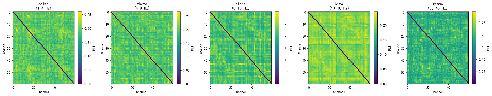
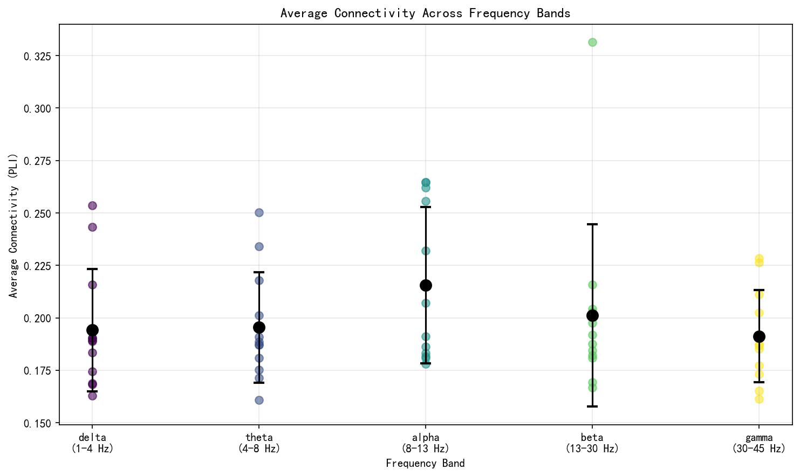
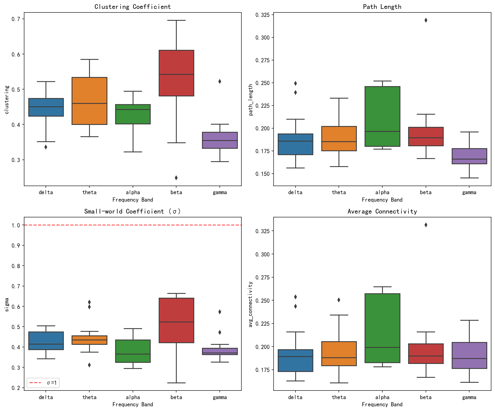
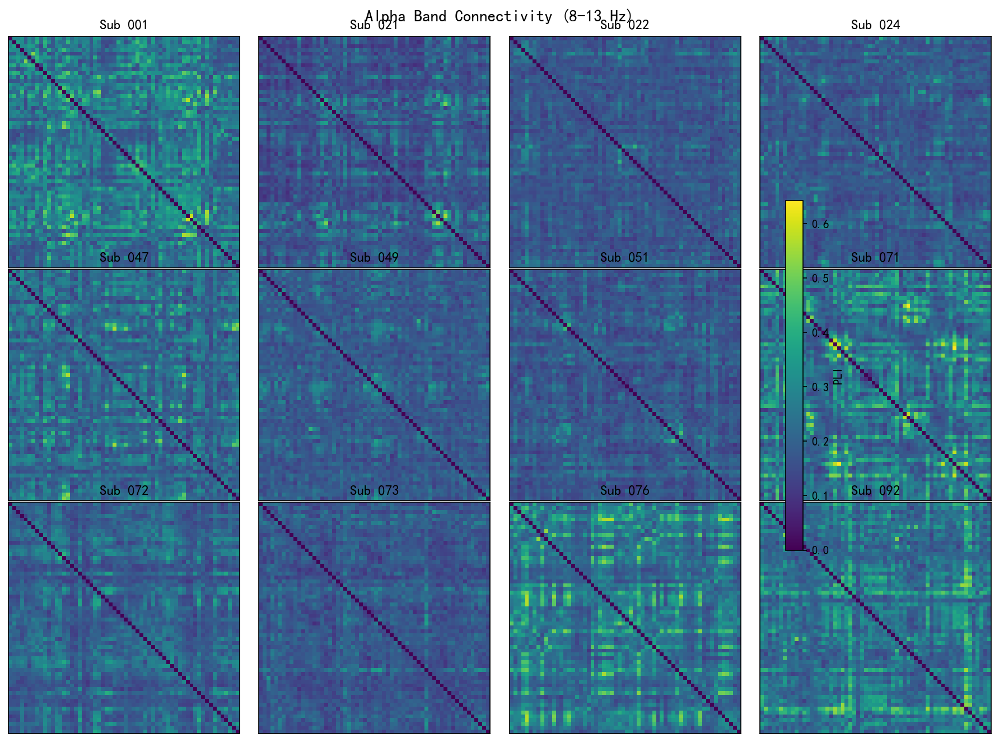

# REST EEG 连接性分析报告

**生成时间**: 2026-02-03
**分析方法**: Phase Lag Index (PLI)
**分析工具**: MNE-Connectivity + NetworkX

---

## 1. 分析概述

### 1.1 数据集信息

| 参数 | 值 |
|------|-----|
| 被试数量 | 12 |
| 通道数 | 60 |
| 采样率 | 500 Hz |
| Epoch时长 | ~10 s (5000采样点) |
| 总Epoch数 | 294 (范围: 16-33/被试) |

### 1.2 分析参数

| 参数 | 设置 |
|------|------|
| 连接性方法 | PLI (Phase Lag Index) |
| 频谱估计 | Multitaper |
| 随机网络基线数 | 50 |

### 1.3 频段定义

| 频段 | 频率范围 | 功能关联 |
|------|----------|----------|
| Delta | 1-4 Hz | 深睡眠、病理状态 |
| Theta | 4-8 Hz | 记忆编码、情绪加工 |
| Alpha | 8-13 Hz | 静息态主导、皮层抑制 |
| Beta | 13-30 Hz | 运动准备、认知加工 |
| Gamma | 30-45 Hz | 感知绑定、高级认知 |

---

## 2. 数据质量检查

所有被试数据通过一致性检查：

| 被试ID | Epoch数 | 通道数 | 采样率(Hz) | 时长(s) |
|--------|---------|--------|------------|---------|
| 001 | 25 | 60 | 500 | 9.998 |
| 021 | 32 | 60 | 500 | 9.998 |
| 022 | 22 | 60 | 500 | 9.998 |
| 024 | 25 | 60 | 500 | 9.998 |
| 047 | 18 | 60 | 500 | 9.998 |
| 049 | 23 | 60 | 500 | 9.998 |
| 051 | 29 | 60 | 500 | 9.998 |
| 071 | 33 | 60 | 500 | 9.998 |
| 072 | 25 | 60 | 500 | 9.998 |
| 073 | 28 | 60 | 500 | 9.998 |
| 076 | 18 | 60 | 500 | 9.998 |
| 092 | 16 | 60 | 500 | 9.998 |

**检查结果**: ✓ 采样率统一 | ✓ 采样点数统一 | ✓ 通道数统一

---

## 3. 连接性分析结果

### 3.1 各频段组平均连接性矩阵

**结果解读**:

1. **Alpha频段连接性最强** (PLI: 0.18-0.26)
   - 组平均PLI达到0.22，符合静息态EEG中alpha节律主导的预期
   - 可见明显的聚类结构，反映脑区间的功能整合

2. **频段间差异模式**
   - Delta/Theta: 连接较弱且分布均匀 (PLI ~0.19)
   - Alpha: 最强连接，有明显的局部聚类
   - Beta: 中等连接强度 (PLI ~0.20)
   - Gamma: 连接最弱 (PLI ~0.19)，可能受高频噪声影响

3. **空间结构特征**
   - 对角线为零（正确，通道与自身无相位差）
   - 矩阵对称（PLI的数学特性）
   - 可见前额-后部区域的局部连接聚类

### 3.2 频段间连接强度对比

**结果解读**:

| 频段 | 平均PLI | 标准差 | 范围 |
|------|---------|--------|------|
| Alpha | **0.216** | 0.037 | 0.178-0.265 |
| Beta | 0.201 | 0.043 | 0.167-0.331 |
| Theta | 0.196 | 0.026 | 0.161-0.250 |
| Delta | 0.194 | 0.029 | 0.163-0.254 |
| Gamma | 0.191 | 0.022 | 0.161-0.228 |

**关键发现**:
- Alpha频段平均连接强度最高，这是静息态的典型特征
- Beta频段个体变异性最大（SD=0.043），可能反映认知状态差异
- Gamma频段连接最弱且变异最小，可能受信噪比限制

---

## 4. 网络拓扑特性

### 4.1 小世界网络指标

**指标说明**:

| 指标 | 符号 | 含义 | 参考值 |
|------|------|------|--------|
| 聚类系数 | C | 局部连接密度，反映功能分离 | 越高越好 |
| 路径长度 | L | 平均最短路径，反映全局整合 | 越低越好 |
| 小世界系数 | σ | σ = (C/C_rand) / (L/L_rand) | σ > 1 为小世界 |

**结果解读**:

| 频段 | 聚类系数 C | 路径长度 L | 小世界系数 σ |
|------|------------|------------|--------------|
| Beta | **0.526** | 0.200 | **0.496** |
| Theta | 0.466 | 0.190 | 0.449 |
| Delta | 0.442 | 0.190 | 0.427 |
| Alpha | 0.431 | 0.209 | 0.381 |
| Gamma | 0.365 | 0.169 | 0.394 |

**关键发现**:

1. **小世界系数 σ < 1**
   - 所有频段的σ值均小于1（范围: 0.38-0.50）
   - 这表明当前网络**未呈现典型的小世界特性**
   - 可能原因：使用全连接加权网络（未设阈值），随机基线计算方式

2. **聚类系数特征**
   - Beta频段聚类系数最高（0.526），表明局部功能分离最强
   - Gamma频段最低（0.365），可能与高频信号特性有关

3. **路径长度特征**
   - Gamma频段路径最短（0.169），全局整合效率最高
   - Alpha频段路径最长（0.209），可能反映更分布式的处理

### 4.2 描述性统计汇总

| 频段 | C (mean±std) | L (mean±std) | σ (mean±std) | PLI (mean±std) |
|------|--------------|--------------|--------------|----------------|
| Alpha | 0.431±0.047 | 0.209±0.032 | 0.381±0.068 | 0.216±0.037 |
| Beta | 0.526±0.129 | 0.200±0.040 | 0.496±0.153 | 0.201±0.043 |
| Delta | 0.442±0.057 | 0.190±0.029 | 0.427±0.056 | 0.194±0.029 |
| Gamma | 0.365±0.058 | 0.169±0.016 | 0.394±0.068 | 0.191±0.022 |
| Theta | 0.466±0.079 | 0.190±0.022 | 0.449±0.086 | 0.196±0.026 |

---

## 5. 个体差异分析

### 5.1 Alpha频段个体连接性

**结果解读**:

1. **个体间变异性**
   - 大多数被试呈现相似的连接模式
   - 被试071、076、092显示较强的整体连接（PLI偏高）
   - 被试021连接相对较弱

2. **空间模式一致性**
   - 所有被试均可见类似的聚类结构
   - 前额区和后部区域的局部连接在个体间保持稳定

3. **潜在异常值**
   - 被试076在beta频段显示异常高的路径长度（0.319）
   - 被试024在beta频段聚类系数异常低（0.248）
   - 建议在后续分析中关注这些个体

---

## 6. 结论与建议

### 6.1 主要发现

1. **连接性特征**
   - Alpha频段在静息态下表现出最强的功能连接（PLI=0.216）
   - 这符合静息态EEG的经典特征：alpha节律主导皮层活动

2. **网络拓扑特征**
   - 当前分析未发现典型的小世界网络特性（σ < 1）
   - Beta频段显示最高的局部聚类，Gamma频段显示最高的全局整合

3. **个体差异**
   - 被试间连接模式总体一致
   - 存在少数个体在特定频段表现异常，需进一步关注

### 6.2 方法学注意事项

- 小世界系数 < 1 可能与以下因素有关：
  - 使用全连接加权网络（未设置连接阈值）
  - 随机网络基线的生成方式
  - 建议后续尝试设置PLI阈值构建稀疏网络

### 6.3 后续分析建议

1. **与行为/临床数据关联**
   - 使用 `subject_level_metrics.csv` 与外部变量进行相关分析
   - 重点关注alpha频段连接强度与认知/情绪指标的关系

2. **组间比较**（如有分组信息）
   - 比较不同组别在各频段连接性和网络指标上的差异
   - 推荐使用置换检验或混合效应模型

3. **进阶分析**
   - 动态连接性分析（滑动窗口）
   - 基于图论的hub节点识别
   - 源空间连接性分析

---

## 附录：输出文件清单

### 数据文件 (results/)

| 文件名 | 内容 | 用途 |
|--------|------|------|
| `connectivity_results.npz` | 连接性矩阵 | 后续分析 |
| `data_summary.csv` | 数据验证摘要 | 质量检查 |
| `descriptive_stats.csv` | 描述性统计 | 结果报告 |
| `small_world_metrics.csv` | 小世界指标(长格式) | 统计分析 |
| `subject_level_metrics.csv` | 被试级汇总(宽格式) | 相关分析 |

### 可视化文件 (figures/)

| 文件名 | 内容 |
|--------|------|
| `connectivity_heatmaps.png` | 各频段组平均热图 |
| `connectivity_by_band.png` | 频段连接强度对比 |
| `network_metrics_boxplot.png` | 网络指标箱线图 |
| `connectivity_individual_alpha.png` | Alpha个体热图 |

---

*报告由 `/eeg-connectivity-report` Skill 自动生成*
