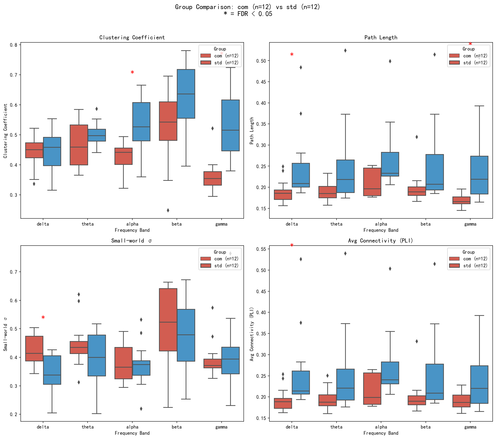
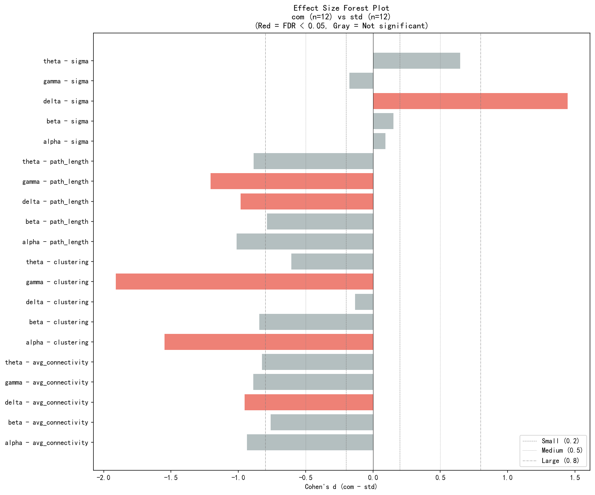
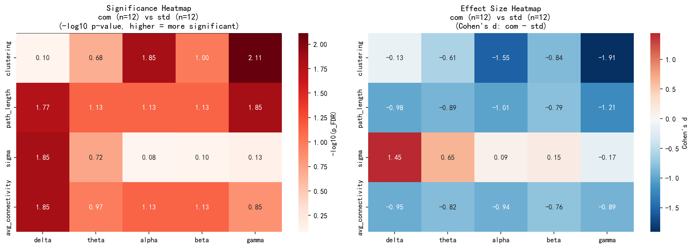

# 组间统计分析报告 - com vs std

**生成时间**: 2026-02-03 20:04

---

## 1. 分析概况

| 项目 | 值 |
|------|-----|
| 共患组 (com) 被试数 | 12 |
| 正常组 (std) 被试数 | 12 |
| 总样本量 | 24 |
| 分析指标数 | 4 (连接性) |
| 频段数 | 5 |
| 总比较数 | 20 |
| 显著结果数 (FDR < 0.05) | 6 |

---

## 2. 统计方法

- **正态性检验**: Shapiro-Wilk 检验
- **组间比较**:
  - 正态分布 → 独立样本 t 检验
  - 非正态分布 → Mann-Whitney U 检验
- **多重比较校正**: FDR (Benjamini-Hochberg)
- **效应量**: Cohen's d

---

## 3. 连接性指标结果

### 3.1 描述性统计

| 指标 | 频段 | com (n=12, M±SD) | std (n=12, M±SD) |
|------|------|------------|------------|
| clustering | delta | 0.4419±0.0548 | 0.4506±0.0743 |
| clustering | theta | 0.4659±0.0756 | 0.5023±0.0384 |
| clustering | alpha | 0.4311±0.0446 | 0.5350±0.0837 |
| clustering | beta | 0.5263±0.1230 | 0.6231±0.1053 |
| clustering | gamma | 0.3648±0.0558 | 0.5296±0.1085 |
| path_length | delta | 0.1897±0.0281 | 0.2527±0.0861 |
| path_length | theta | 0.1900±0.0207 | 0.2527±0.0979 |
| path_length | alpha | 0.2094±0.0307 | 0.2710±0.0803 |
| path_length | beta | 0.1996±0.0384 | 0.2564±0.0944 |
| path_length | gamma | 0.1691±0.0157 | 0.2542±0.0985 |
| sigma | delta | 0.4270±0.0536 | 0.3407±0.0653 |
| sigma | theta | 0.4490±0.0821 | 0.3932±0.0903 |
| sigma | alpha | 0.3811±0.0649 | 0.3745±0.0774 |
| sigma | beta | 0.4959±0.1464 | 0.4752±0.1232 |
| sigma | gamma | 0.3939±0.0649 | 0.4119±0.1315 |
| avg_connectivity | delta | 0.1942±0.0278 | 0.2602±0.0940 |
| avg_connectivity | theta | 0.1955±0.0252 | 0.2560±0.1007 |
| avg_connectivity | alpha | 0.2156±0.0356 | 0.2738±0.0804 |
| avg_connectivity | beta | 0.2012±0.0416 | 0.2566±0.0943 |
| avg_connectivity | gamma | 0.1913±0.0210 | 0.2545±0.0984 |

### 3.2 统计检验结果

| 指标 | 频段 | 检验方法 | p值 | p_FDR | Cohen's d | 显著 |
|------|------|----------|-----|-------|-----------|------|
| clustering | delta | t-test | 0.7575 | 0.7973 | -0.133 |  |
| clustering | theta | t-test | 0.1686 | 0.2108 | -0.607 |  |
| clustering | alpha | t-test | 0.0015 | 0.0142 | -1.549 | ✓ |
| clustering | beta | t-test | 0.0602 | 0.1003 | -0.845 |  |
| clustering | gamma | Mann-Whitney U | 0.0004 | 0.0077 | -1.910 | ✓ |
| path_length | delta | Mann-Whitney U | 0.0051 | 0.0170 | -0.983 | ✓ |
| path_length | theta | Mann-Whitney U | 0.0351 | 0.0735 | -0.886 |  |
| path_length | alpha | Mann-Whitney U | 0.0262 | 0.0735 | -1.013 |  |
| path_length | beta | Mann-Whitney U | 0.0351 | 0.0735 | -0.788 |  |
| path_length | gamma | Mann-Whitney U | 0.0029 | 0.0142 | -1.206 | ✓ |
| sigma | delta | t-test | 0.0026 | 0.0142 | 1.445 | ✓ |
| sigma | theta | t-test | 0.1437 | 0.1916 | 0.647 |  |
| sigma | alpha | t-test | 0.8305 | 0.8305 | 0.092 |  |
| sigma | beta | t-test | 0.7243 | 0.7973 | 0.152 |  |
| sigma | gamma | Mann-Whitney U | 0.6236 | 0.7337 | -0.174 |  |
| avg_connectivity | delta | Mann-Whitney U | 0.0035 | 0.0142 | -0.953 | ✓ |
| avg_connectivity | theta | Mann-Whitney U | 0.0690 | 0.1061 | -0.823 |  |
| avg_connectivity | alpha | Mann-Whitney U | 0.0404 | 0.0735 | -0.937 |  |
| avg_connectivity | beta | Mann-Whitney U | 0.0404 | 0.0735 | -0.761 |  |
| avg_connectivity | gamma | Mann-Whitney U | 0.0999 | 0.1427 | -0.889 |  |

### 3.3 显著性结果汇总

以下指标在组间存在显著差异 (FDR < 0.05):

- **clustering (alpha)**: com < std, d = -1.549
- **clustering (gamma)**: com < std, d = -1.910
- **path_length (delta)**: com < std, d = -0.983
- **path_length (gamma)**: com < std, d = -1.206
- **sigma (delta)**: com > std, d = 1.445
- **avg_connectivity (delta)**: com < std, d = -0.953

---

## 4. 可视化

### 4.1 连接性指标箱线图

### 4.2 效应量森林图

### 4.3 显著性热图

---

## 5. 效应量解读

| Cohen's d | 解读 |
|-----------|------|
| |d| < 0.2 | 微小效应 |
| 0.2 ≤ |d| < 0.5 | 小效应 |
| 0.5 ≤ |d| < 0.8 | 中等效应 |
| |d| ≥ 0.8 | 大效应 |

---

## 6. 结论

本分析发现 6 个指标在共患组和正常组之间存在显著差异。

---

*报告由 REST EEG Pipeline 自动生成*
